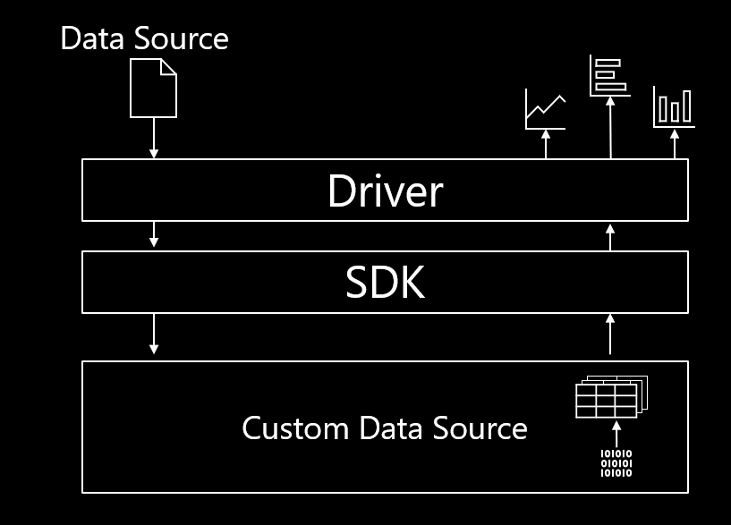
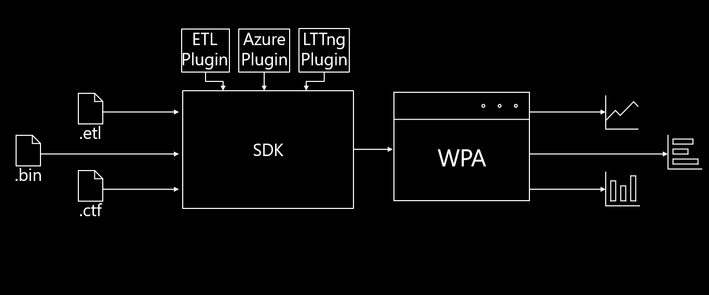

# Architecture Overview

This document outlines the architecture of the Microsoft Performance Toolkit SDK.

For more detailed information on how to create your own project using the SDK, please view [Creating your own project](../Using-the-SDK/Creating-your-project.md). 

Examples:
- [Custom Data Source Example](../../samples/SimpleDataSource/SimpleCustomDataSource.cs).
- [Custom Data Processor Example](../../samples/SimpleDataSource/SimpleCustomDataProcessor.cs). 

# Microsoft Performance Toolkit SDK

The Microsoft Performance Toolkit SDK was built to empower users to analyze any arbitrary data source (e.g. .etl, .ctf, etc). 
Using the SDK, any data source (including large files) can be quickly processed to generate custom graphs and tables.
Below is a brief overview of the structure of the SDK.

# Step-by-step
1) Select Data Source in Driver
2) Driver passes Data Source to SDK
3) SDK passes Data Source to the Custom Data Source
4) Custom Data Source validates Data Source and sends plugin (compiled binaries) to SDK
5) Plugins create default/custom tables which the SDK dynamically sends to the Driver
6) Driver displays visualized data for interaction and manipulation

# Driver

The Driver's main objective is to render data for a user to consume and interact with. The user can select any data source which will be sent down to the SDK, which will in turn return tables for visualization.
We recommend using Windows Performance Analyzer (WPA) to interact with the data as it grants a plethora of tools for analysis.

# SDK

The SDK operates as an interface between the Driver and Custom Data Source. It facilitates the data retrieval from the CDS and dynamically loads that information to the Driver.

# Plugins

A plugin is one or more Custom Data Sources compiled as a package of binaries for the SDK to read. A plugin contains the logic
to read, format, and standardize the data from particular data sources into programmatically accessible data for the SDK to serve to the Driver.

In the above example, there must be an ETL plugin to read an .etl trace file (data source).

## Custom Data Source Model

Click to Expand

 

A Custom Data Source (CDS) is a containerized unit which has instructions to parse the Data Source. 
Every Custom Data Source has to advertise the supported file types (data sources). 
If the relevant binaries exist, the CDS has the logic for creating tables from the data source.

The tables are returned as binary instructions from the Data Processor to the SDK to create 0 or more tables.
The Driver (WPA is recommended) dynamically loads each Custom Data Source at runtime through the SDK.

The Custom Data Source Model allows developers to use any arbitrary data source with the SDK to build desired tables using plugins. 

For implementation details, please view [Using the SDK/Creating A Simple Custom Data Source](../Using-the-SDK/Creating-a-simple-custom-data-source.md).

# Next Steps

To best understand how the SDK works and how to develop SDK plugins, it is recommended to read documentation in the following order:
1) [Overview](./Overview.md) to understand at a high level the various system the SDK provides
2) [The Data Processing Pipeline](./The-Data-Processing-Pipeline.md) to understand how to systematically process data that 
can be used by tables
3) [Data Extensions](.Data-Extensions.md) to understand how data involved in data processing pipelines can be used by 
other plugins
4) [Using the SDK/Creating an SDK Plugin C# Project](./Using-the-SDK/Creating-your-project.md) to get your developer environment ready to create an SDK plugin
5) [Using the SDK/Creating a Simple Custom Data Source](./Using-the-SDK/Creating-a-simple-custom-data-source.md) to see how to create a basic plugin that can 
take in a specific data source and output structured tables
6) [Using the SDK/Creating a Data Processing Pipeline](./Using-the-SDK/Creating-a-pipeline.md) to see how to create a data processing pipeline that 
exposes data that can be consumed by your tables and other plugins
7) [Using the SDK/Creating an Extended Table](./Using-the-SDK/Creating-an-extended-table.md) to see how to use data cookers to obtain the data to display 
inside of a table