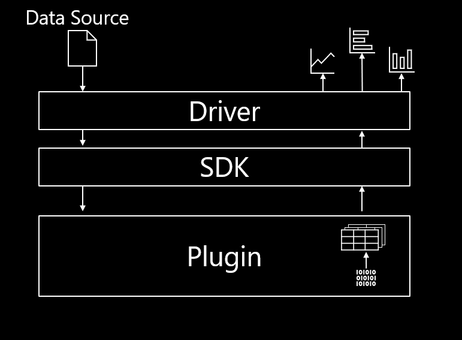

# Architecture Overview

This document outlines the architecture of the Microsoft Performance Toolkit SDK.

For more detailed information on how to create your own project using the SDK, please view [Creating your own project](../Using-the-SDK/Creating-your-project.md). 

Examples:
- [Custom Data Source Example](../../samples/SimpleDataSource/SimpleCustomDataSource.cs).
- [Custom Data Processor Example](../../samples/SimpleDataSource/SimpleCustomDataProcessor.cs). 

# Microsoft Performance Toolkit SDK

The Microsoft Performance Toolkit SDK was built to empower users to analyze any arbitrary data source (e.g. .etl, .txt, lttng, etc). Using the SDK, any data source (including large files) can be quickly processed to generate custom graphs and tables.
Below is a brief overview of the structure of the SDK.

# Step-by-step
1) Select Data Source in Driver
2) Driver passes Data Source to SDK
3) SDK passes Data Source to the Custom Data Source
4) Custom Data Source validates Data Source and sends plugin (compiled binaries) to SDK
5) SDK creates default/custom tables based on the plugin logic  
6) Driver displays visualized data for interaction and manipulation

# Driver

The Driver's main objective is to render data for a user to consume and interact with. The user can select any data source which will be sent down to the SDK, which will in turn return tables for visualization.
We recommend using Windows Performance Analyzer (WPA) to interact with the data as it grants a plethora of tools for analysis.

# SDK

The SDK is primarily responsible for building relevant tables and graphs. Using plugin logic from the [Data Processor](./The-Data-Processing-Pipeline.md), the SDK creates custom tables and/or graphs.

# Custom Data Source

[Architecture/The Custom Data Source](.The-Custom-Data-Source-Model.md) is a native binary which can parse the Data Source. A Custom Data Source (CDS) advertises the data source which it can parse.
If the relevant binaries exist, the CDS has the logic for creating tables from the data source in a . 
One or more Custom Data Sources is a plugin. Plugins are compiled into binaries which are loaded into the SDK to handle table building.

# Next Steps

To best understand how the SDK works and how to develop SDK plugins, it is recommended to read documentation in the following order:
1) [Architecture/Overview](./Architecture/Overview.md) to understand at a high level the various system the SDK provides
2) [Architecture/The Custom Data Source Model](./Architecture/The-Custom-Data-Source-Model.md) to understand how the SDK allows developers to implement 
logic for processing arbitrary data sources
3) [Architecture/The Data Processing Pipeline](./Architecture/The-Data-Processing-Pipeline.md) to understand how to systematically process data that 
can be used by tables
4) [Architecture/Data Extensions](./Architecture/Data-Extensions.md) to understand how data involved in data processing pipelines can be used by 
other plugins
5) [Using the SDK/Creating an SDK Plugin C# Project](Using-the-SDK/Creating-your-project.md) to get your developer environment ready to create an SDK plugin
6) [Using the SDK/Creating a Simple Custom Data Source](Using-the-SDK/Creating-a-simple-custom-data-source.md) to see how to create a basic plugin that can 
take in a specific data source and output structured tables
7) [Using the SDK/Creating a Data Processing Pipeline](Using-the-SDK/Creating-a-pipeline.md) to see how to create a data processing pipeline that 
exposes data that can be consumed by your tables and other plugins
8) [Using the SDK/Creating an Extended Table](Using-the-SDK/Creating-an-extended-table.md) to see how to use data cookers to obtain the data to display 
inside of a table