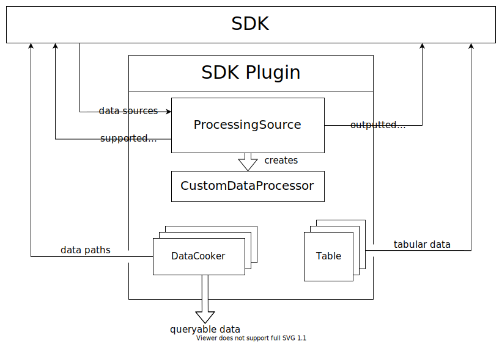

# Architecture Overview

This document outlines the architecture of the Microsoft Performance Toolkit SDK.

For more detailed information on how to create your own project using the SDK, please view [Creating an SDK Plugin](../Using-the-SDK/Creating-your-plugin.md). 

## High-Level Interfaces

The Microsoft Performance Toolkit SDK was built to empower users to analyze arbitrary data sources (e.g. `.etl` files, `.ctf` files, SQL server logs, `.csv` files, etc.). 
Users can develop extensible *SDK plugins* that contain logic for processing data sources into tables, which are sent to an *SDK driver* (such as 
the [Windows Performance Analyzer](https://docs.microsoft.com/en-us/windows-hardware/test/wpt/windows-performance-analyzer)) to render. At the highest 
level, it exposes the following interfaces:

The interfaces depicted in this diagram are

1) The SDK receives *data sources* (e.g. file paths) from the *SDK driver*. For example, the SDK may receive this input when the user asks 
the driver to open a file.
2) The SDK passes the data sources to all *SDK plugins* which can support them. Plugins are 
loaded dynamically at runtime by the SDK driver before the data sources are given to the SDK. In this example, 2 out of the 3 loaded plugins advertise that 
they can handle the loaded data source.
3) Plugins can optionally exchange data through *data cookers*, even if the two plugins do not have access to each others' source code. In this 
example, plugin B queries for and receives data from plugin A. Note that this data can be programmatically 
accessed by anyone - not just other plugins. See [Plugins](#Plugins) for more details.
4) Each plugin given the data sources returns *tables* to the SDK. Note that a plugin which advertises support for a data source may return no tables, but that 
is unlikely to happen in practice.
5) The SDK outputs all tables created by plugins to the SDK driver.
6) The SDK driver does whatever it wishes with the tables. For example, WPA displays the tables along with interactable and manipulatable graphs.

Note that in this example only *one* data source is given to the SDK. In practice, multiple data sources may be passed in simultatenously. The SDK 
handles mapping data sources to the correct plugins, and each plugin sees as input a *list* of data sources for which it advertises support. 

With these high-level interfaces defined, we will now examine each component in greater detail. 

## The SDK Driver

The SDK driver's main objective is to render data for a user to observe and interact with. The driver can provide the SDK with arbitrary data sources 
to process. For GUI drivers, these data sources are typically the file paths a user asks the driver to open. However, 
more programmatic drivers such as scripts may pass down hard-coded data sources. 

We recommend using the [Windows Performance Analyzer](https://docs.microsoft.com/en-us/windows-hardware/test/wpt/windows-performance-analyzer) 
as the SDK driver since it grants a plethora of tools for performance analysis. For more information on how to install WPA, 
see [Using the SDK/Installing WPA](Using-the-SDK/Installing-WPA.md). 

Creating an SDK driver is currently outside the scope of this documentation, although it may be added in the future.

## SDK

The SDK operates as a common interface between the driver and plugins. It facilitates 
1) Loading plugins at the request of the SDK driver
2) Distributing data sources to the appropriate plugins
3) Processing (also known as cooking) data within a plugin through a [processing pipeline](./The-Data-Processing-Pipeline)
4) Querying and piping data between either two concurrently loaded plugins or a loaded plugin and an assembly with programmatic 
   access to the running instance of the SDK (even if the data originates from a plugin which the destination does 
   not have the source code for)
5) Providing the SDK driver populated tables created by loaded plugins

## Plugins

From an interface perspective, a plugin is a collection of
* One or more `ProcessingSource`s
* One `CustomDataProcessor` for each `ProcessingSource`
* Zero or more `Table`s
* Zero or more `DataCooker`s

that work together to
1) Consume specific data sources that the SDK provides
2) Expose data that can be programmatically accessed by outside sources, such as other plugins
3) Create populated tables that get sent to the SDK

A plugin is an **abstract collection of these objects** which can be bundled together for distribution and loaded as a single 
unit by the SDK driver. *A plugin can be, and often is, made up of multiple assemblies*.

> :warning: Note that while a single assembly *can* define more than one `ProcessingSource`, __it is highly recommended that an assembly only contains 
> a single `ProcessingSource`.__ Tables, data cookers, and custom data processors are almost always associated with a single `ProcessingSource`. 
> It is best therefore to package __only one__ `ProcessingSource` and all of its associated classes in a single binary. 

The diagram below demonstrates how these objects work together to acheive this high-level interface:

1) The `ProcessingSource` advertises to the SDK which data sources it supports and all the tables a driver can consume from it. The `ProcessingSource` is 
   primarily an interface definition, but it also implements creating a `CustomDataProcessor`
2) The `CustomDataProcessor` contains implementation logic for processing the data sources provided by the SDK. The data sources 
   are given to the `ProcessingSource`, which typically passes them to the `CustomDataProcessor` it creates
3) `DataCooker` classes participate in the plugin's [processing pipeline](./The-Data-Processing-Pipeline) and
    1) Export `DataOutput`s that can be queried, via the SDK, by anyone who knows an output's *data path*
    2) Advertise to the SDK *data paths* that can be used by either outside sources (such as concurrently loaded plugins), or other parts 
       of that cooker's plugin, to query that cooker's `DataOutput`s
4) `Table` classes populate the tables ultimately returned by the plugin. The data inside these tables comes from the `CustomDataProcessor`,
   either directly or indirectly through a [processing pipeline](./The-Data-Processing-Pipeline)

For implementation details on how to create a simple plugin containing one `ProcessingSource`, its associated `CustomDataProcessor` and a
`Table`, please view [Using the SDK/Creating A Simple SDK Plugin](../Using-the-SDK/Creating-a-simple-sdk-plugin.md).

For implementation details on how to create a plugin containing `DataCooker`s, please view [Using the SDK/Creating a Data-Processing Pipeline](../Using-the-SDK/Creating-a-pipeline.md)

# Next Steps

Now that we understand the high-level overview of the SDK architecture, the next step is to better understand how the data processing 
pipeline works. Continue reading at [Architecture/The Data-Processing Pipeline](./The-Data-Processing-Pipeline.md).