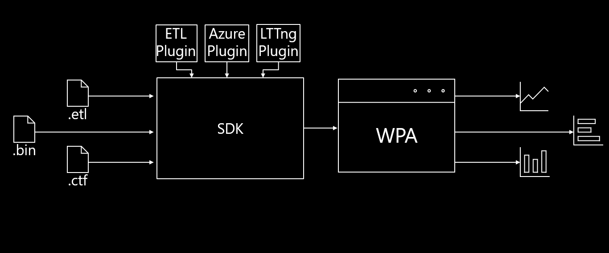

# The Custom Data Source Model

Custom Data Sources are containerized units with instructions on processing the data sources it advertises as supporting, and uses Data Processors to return 0 or more tables back to the SDK

The Custom Data Source Model allows developers to use any arbitrary data source with the SDK to build desired tables using plugins. 
A plugin is one or more Custom Data Sources compiled as a package of binaries for the SDK to read.

Every Custom Data source has to advertise the file types (data sources) are supported. They also contain logic for data processors which creates tables from the data source.
The UI Driver (WPA is recommended) dynamically loads each Custom Data Source at runtime through the SDK.

For implementation details, please view [Using the SDK/Creating A Simple Custom Data Source](../Using-the-SDK/Creating-a-simple-custom-data-source.md).

# Next Steps

To best understand how the SDK works and how to develop SDK plugins, it is recommended to read documentation in the following order:
1) [Architecture/Overview](./Architecture/Overview.md) to understand at a high level the various system the SDK provides
2) [Architecture/The Custom Data Source Model](./Architecture/The-Custom-Data-Source-Model.md) to understand how the SDK allows developers to implement 
logic for processing arbitrary data sources
3) [Architecture/The Data Processing Pipeline](./Architecture/The-Data-Processing-Pipeline.md) to understand how to systematically process data that 
can be used by tables
4) [Architecture/Data Extensions](./Architecture/Data-Extensions.md) to understand how data involved in data processing pipelines can be used by 
other plugins
5) [Using the SDK/Creating an SDK Plugin C# Project](Using-the-SDK/Creating-your-project.md) to get your developer environment ready to create an SDK plugin
6) [Using the SDK/Creating a Simple Custom Data Source](Using-the-SDK/Creating-a-simple-custom-data-source.md) to see how to create a basic plugin that can 
take in a specific data source and output structured tables
7) [Using the SDK/Creating a Data Processing Pipeline](Using-the-SDK/Creating-a-pipeline.md) to see how to create a data processing pipeline that 
exposes data that can be consumed by your tables and other plugins
8) [Using the SDK/Creating an Extended Table](Using-the-SDK/Creating-an-extended-table.md) to see how to use data cookers to obtain the data to display 
inside of a table