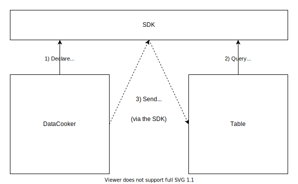
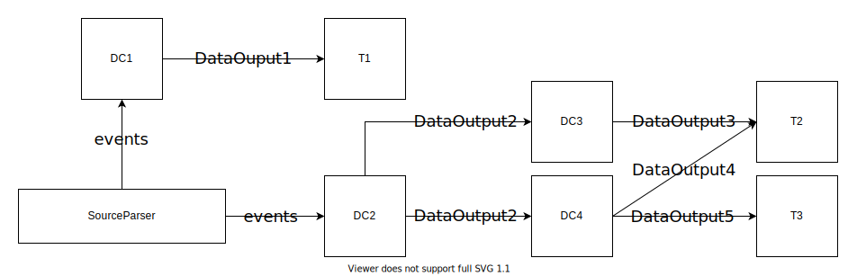

# The Data-Processing Pipeline

Within a plugin, a `ProcessingSource` delegates the task of processing data sources to a `CustomDataProcessor`. 
In order to minimize the overhead of accessing persistent data storage, a well-designed plugin aims to have its 
`CustomDataProcessor`s directly access data sources as infrequently as possible. Additionally, it would be nice 
if the SDK provided a way to
1) Allow plugins to systematically transform raw data points into an arbitrary data type
2) Containerize these transformations into specific modules that exist outisde of the `CustomDataProcessor`
3) Use the output of these transformations in mulitple locations within these modules' plugin (e.g. *share* the output)
4) Allow external binaries, such as other plugins, access to the output of these transformations (as in *extend* the plugin defining the transformation)

The SDK allows a plugin to achieve these goals, while minimizing the number of times data sources need to be directly accessed, 
by facilitating and allowing the creation of a __data-processing pipeline__.

# Pipeline Components

At the highest level, when a plugin wishes to create a data-processing pipeline, it will define two types of 
components: __source parsers__ and __data cookers__.

## Source Parsers

A `SourceParser` is a class that is responsible for parsing data sources on behalf of a `CustomDataProcessor`. 
Conceptually, a `CustomDataProcessor` *delegates* the task of 
processing its data sources to a `SourceParser`.

> :question: This delegation raises the question: if a data processor can just further delegate work, 
> why have the data processor in the first place? The reason for having both classes is that
> 1) `CustomDataProcessor`s were introduced well before `SourceParser`s and
> 2) Having both provides developers with more flexibility on how they structure their plugins

From an interface perspective, a `SourceParser` has the following properties:
* A `SourceParser` has a `string` identifier
* A `SourceParser` is bound to a specific `CustomDataProcesor`
* A `SourceParser` must, at some point, process the data sources originally given to the `ProcessingSource` which  
  created the `CustomDataProcessor` the parser is bound to 
* A `SourceParser` will, *while processing its data sources*, emit each individual data point contained 
  within the data sources it is processing

The data points a `SourceParser` emits are called __events__, and each __event__ must have a *key*. Conceptually, 
the emitted events are `(key, value)` pairs contained within a single class, where each value is a data point and its 
key is some property of the data point. 

A `SourceParser` emits each event one at a time. __It is highly encouraged to make sure a source parser 
only parses/iterates the data inside its data sources once, emitting each event as soon as it is 
encountered.__

## Data Cookers

A `DataCooker` is a class that is responsible for implementing the data transformations whose 
outputs are accessible by both other plugin modules and external binaries. 
From an interface perspective, a `DataCooker` has the following properties:
* A `DataCooker` has a `DataCookerPath` that can 
    1) be recreated by other modules (or external assemblies) and 
    2) be used to reference that `DataCooker` (even without access to that `DataCooker`'s source code)
* A `DataCooker` consumes data from from either a *single source parser* or *one or more data cookers*
* A `DataCooker` processes (cooks) this data
* A `DataCooker` exposes zero or more __data output__ properties

`DataOutput`s are the key component of data cookers, and are what achieve the last two goals outlined at the beginning of this document. 
The SDK is aware of every `DataOutput` a given `DataCooker` advertises, and any assembly with access to an instance of 
the SDK with a `DataCooker` loaded can query that cooker for any of its `DataOutput`s. For instance, a `Table` can 
query transformed data outputted by a `DataCooker` defined inside its own assembly:

In this example, first the `DataCooker` declares a `DataOutput` of type `int` whose name is `Foo`. Then, the `Table` 
asks the SDK for that `DataOutput`. As a result, the `Table` receives `Foo`.

To query a `DataOutput`, the querying code only needs to know
1) The `DataCookerPath` for the `DataCooker` it wishes to receive data from
2) The (`string`) name of the `DataOutput` property of that `DataCooker`
3) The type of the `DataOutput` property

Because the querying code only needs these three properties, external assemblies - even those without access to 
any `DataCooker`s' source code - can query the SDK for data from any `DataCooker` which is loaded.

Finally, the SDK facilitates both the transfer of data and ensuring that a queried `DataCooker`'s `DataOutput` is ready. If, for 
example, the `DataCooker` above receives input from a `SourceParser`, the SDK will ensure that the `SourceParser` has processed 
all of its data sources - and that the `DataCooker` has received ("cooked") all of its required data - *before* the `DataOutput` 
is sent to the `Table`.

### Data Cooker Types

As mentioned above, a `DataCooker` can consume data from either a single `SourceParser` or one or more other `DataCooker`s. 
The SDK handles these cases differently, so it is important to understand the differences between them.

#### Source Data Cookers

A `SourceDataCooker` is a `DataCooker` which consumes data from a single `SourceParser`. It must specify
1) The `SourceParser` to consume data from and
2) The keys of the events it wishes to receive

It is helpful to think of keys as "group names" here. A `SourceDataCooker` specifies the "groups," or "types," of 
events it wishes to receive. 

Finally, a `SourceDataCooker` will consume (cook) events *one at a time* as the `SourceParser` emits them

#### Composite Data Cookers

A `CompositeDataCooker` is a `DataCooker` which consumes data from one or more other `DataCooker`s. It must 
specify all of the other `DataCookerPath`s for the `DataCooker`s which it depends upon. The SDK instructs
the `CompositeDataCooker` when *all* of its dependencies have finished processing their data, at which point 
the `CompositeDataCooker` can query the `DataOutput`s it needs to perform *its* transformations.

# Putting Everything Together

By combining `SourceParser`s, `SourceDataCooker`s, and `CompositeDataCooker`s, a plugin can create arbitrarily 
complex and extensible data-processing pipelines. For example, here is a pipeline a plugin may create to 
modularize and promote the extensibility of three tables:

In this example, `DC1` and `DC2` are `SourceDataCooker`s that are concurrently consuming events emitted from the 
`SourceParser`. Table `T1` queries `DC1`'s `DataOutput1` for the data it needs to populate its rows. `DC3` and 
`DC4` are `CompositeDataCooker`s, each querying the same `DataOutput2` property of `DC2`. Finally, tables `T2` and 
`T3` query these composite cookers to receive the data they require. Note that `DC4` 
is exposing two `DataOutput`s, `DataOutput4` (used by `T2`) and `DataOutput5` (used by `T3`). 

All `DataOutput`s shown in this example are, of course, queryable by other assemblies - including, but not limited to, 
other plugins loaded into the SDK.

# Final Note

This documents presents `DataCookers` as a mechanism to *transform* data from one type to another. However, this need not be 
the case for every `DataCooker`. Since a `DataCooker` is not required to expose any `DataOutput`s, it may merely consume data 
and do whatever it wishes with it.

# Next Steps

Now that we understand at a high level how a data-processing pipeline works, we can now begin creating our own 
SDK plugins. To get started, view [Using the SDK/Creating an SDK Plugin](../Using-the-SDK/Creating-your-plugin.md).
