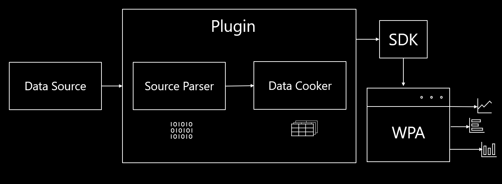

# The Data Processing Pipeline

The Custom Data Source (CDS) uses a Data Processor to read from the Data Source. Since the plugins are dynamically loaded into the Driver by the SDK,
we want to ensure that the Data Processors are efficient in reading and formatting the raw data from the data source.

Due to the Data Processor, we can efficiently access information from multiple binaries and reuse data.
Data can be easily shared and the developer is granted maximal flexibility for modular code.

A Data Processor contains Source Parsers and a Data Cookers.

# Source Parser

The Source Parser is bound to a procesor which is created by a CDS in order to:
* read in raw data from the data source 
* create a standardized data format

The standardized data is then sent to a data cooker.

# Data Cooker

The Data Cooker consumes events sent from the Source Parser and specifies the data keys. 
This allows for the standardized data to be read into a C# data structure and allows programmatic access to any data.

Data Cookers can also send data into tables and to eachother through the SDK.

# Data Extensions

TODO 

# Next Steps

To best understand how the SDK works and how to develop SDK plugins, it is recommended to read documentation in the following order:
1) [Overview](./Overview.md) to understand at a high level the various system the SDK provides
2) [The Data Processing Pipeline](./The-Data-Processing-Pipeline.md) to understand how to systematically process data that 
can be used by tables
4) [Data Extensions](.Data-Extensions.md) to understand how data involved in data processing pipelines can be used by 
other plugins
5) [Using the SDK/Creating an SDK Plugin C# Project](./Using-the-SDK/Creating-your-project.md) to get your developer environment ready to create an SDK plugin
6) [Using the SDK/Creating a Simple Custom Data Source](./Using-the-SDK/Creating-a-simple-custom-data-source.md) to see how to create a basic plugin that can 
take in a specific data source and output structured tables
7) [Using the SDK/Creating a Data Processing Pipeline](./Using-the-SDK/Creating-a-pipeline.md) to see how to create a data processing pipeline that 
exposes data that can be consumed by your tables and other plugins
8) [Using the SDK/Creating an Extended Table](./Using-the-SDK/Creating-an-extended-table.md) to see how to use data cookers to obtain the data to display 
inside of a table