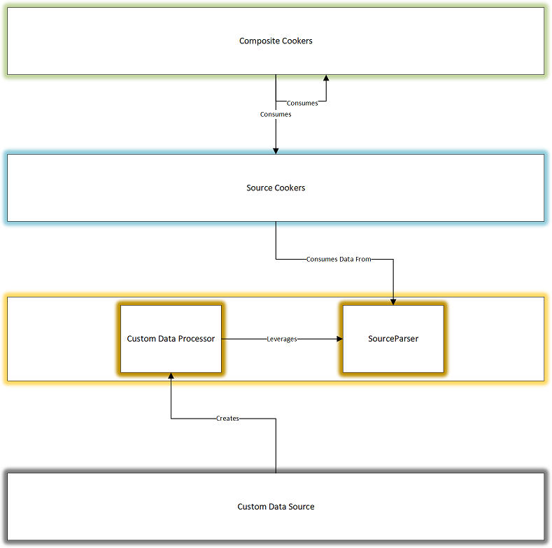

# Creating a Data Processing Pipeline

## Overview

Data Processing Pipelines (DPP) allow you to compose components together to
data from inputs into outputs. A DPP is comprised of the following:
1) Data Source Parser
2) One or more Data Cookers (Cookers)

Cookers can be further broken down into:
1) Source Cookers
2) Composite Cookers

All Cookers expose one or more __Data Outputs__. Data Outputs expose data that
can be consumed by user of the DPP or other Cookers in the DPP.

__Source Cookers__ take data directly from a Data Source Parser and produce
__Data Outputs__. __Composite Cookers__ take data from other cookers to produce
data outputs. A Composite Cooker may depend on both __Source__ and
 __Composite__ cookers.

The following illustrates these concepts:



For a real example, see the LTTng Plugin for WPA, found [Here](https://github.com/microsoft/Microsoft-Performance-Tools-Linux)

## Data Source Parsers

__Data Source Parsers__ parse data from a Data Source into data that can be
manipulated by your application. For example, parsing an ETW ETL file into a
stream of Event objects.  The following are required in order to implement a
Data Source Parser:
1) A Custom Data Source
2) A class implementing SourceParserBase
3) A Custom Data Processor implementing CustomDataProcessorBaseWithSourceParser

A __Custom Data Source__ (1) is required in order to expose your data, whether
you are using DPPs or not. The Custom Data Source is used as the entry point for
creating Custom Data Processors for processing your data. Please see
[here](/Creating-a-simple-custom-data-source) for more on Custom Data Sources.

The __Source Parser__ (2) implements the actual logic of parsing the raw data
into the initial object stream. This Source Parser is passed to the __Custom
Data Processor__ (3) so that the Custom Data Processor can parse the input.

A Source Parser will inherit from 
````
public abstract class SourceParserBase<T, TContext, TKey>
````

where T is the Type of objects being parsed, TContext is defined as an arbitrary
type for you to store Data about parsing, and TKey is how data is keyed.

__Source Parsers__ expose an __Id__ that is used to identify the Source Parser.
This property is used in __Paths__ to the data exposed by the Source Parser.
The sections on Cookers will go into more detail about these Paths.

The following snippet outlines these three components working together to implement
what is required:

````cs

    [CustomDataSource(
        // Id here,
        // Name here,
        // Description here
    )]
    // Other attributes here
    public sealed class SampleCustomDataSource
        : CustomDataSourceBase
    {
        protected override ICustomDataProcessor CreateProcessorCore(
            IEnumerable<IDataSource> dataSources, 
            IProcessorEnvironment processorEnvironment, 
            ProcessorOptions options)
        {
            var parser = new SampleSourceParser(dataSources);

            return new SampleProcessor(
                parser,
                options,
                this.ApplicationEnvironment,
                processorEnvironment,
                this.AllTables,
                this.MetadataTables);
        }

        // rest of class elided
    }

    public sealed class SampleProcessor
        : CustomDataProcessorBaseWithSourceParser<SampleDataObject, SampleContext, int>
    {
        public SampleProcessor(
            ISourceParser<SampleDataObject, SampleContext, int> sourceParser, 
            ProcessorOptions options,
            IApplicationEnvironment applicationEnvironment, 
            IProcessorEnvironment processorEnvironment, 
            IReadOnlyDictionary<TableDescriptor, Action<ITableBuilder, IDataExtensionRetrieval>> allTablesMapping,
            IEnumerable<TableDescriptor> metadataTables) 
            : base(sourceParser, options, applicationEnvironment, processorEnvironment, allTablesMapping, metadataTables)
        {
        }
    }

    public sealed class SampleSourceParser
        : SourceParserBase<SampleDataObject, SampleContext, int>
    {
        public SampleSourceParser(IEnumerable<IDataSource> dataSources)
        {
            // elided
        }

        // The ID of this Parser.
        public override string Id => nameof(SampleSourceParser);

        // Information about the Data Sources being parsed.
        public override DataSourceInfo DataSourceInfo => DataSourceInfo.Default;

        public override void ProcessSource(
            ISourceDataProcessor<SampleDataObject, SampleContext, int> dataProcessor,
            ILogger logger,
            IProgress<int> progress, CancellationToken cancellationToken)
        {
            // Enumerate your data sources, processing them into objects.
            // For each object you parse, be sure to call the dataProcessor.
            // for example:
            //      dataProcessor.ProcessDataElement(
            //          new SampleDataObject()
            //          new SampleContext(),
            //          cancellationToken);
        }
    }

````

## Cookers

__Cookers__ transform Data from one form to another. A Cooker will use the
Data Output objects from one or more sources, and perform a transformation on
said Data, producing new Data Output(s) for other Cookers or end user
applications to consume.

__Source Cookers__ are fed data directly from a __Source Parser__ and create
Data Outputs.

__Composite Cookers__ take data from one or more Cookers (Source or Composite)
and create Data Outputs.

We use the term _Cooked_ to denote Data that has been transformed via a Cooker.

Cooked data is exposed via __Data Outputs__. These Data Outputs
may be consumed directly by the user, or by other Cookers. Data Outputs must
implement the following interface:
````
IKeyedDataItem<T>
````
Data Outputs are identified by __Data Output Paths__,
which uniquely identify the Data Output. A Data Output Path has the following format:
````
    CookerPath/DataOutputPropertyName
````

where
- CookerPath is the Path to the Cooker exposing the Data.
- DataOutputPropertyName is the name of the Property exposing the Data.

A Cooker Path has the following format:
````
    SourceParserId/CookerId
````

where
- SourceParserId is the ID of the Source Parser.
- CookerId is the ID of the Cooker.

Composite Cookers will have an empty ("") Source Parser ID as they are not
tied to any particular source parser, and thus their Paths have the following
form:
````
    /CookerId
````

The following snippet shows simple cookers:

````cs

    // A Source Cooker
    public sealed class SampleSourceCooker
        : BaseSourceDataCooker<SampleDataObject, SampleContext, int>
    {
        public static readonly DataCookerPath DataCookerPath = new DataCookerPath(
            nameof(SampleSourceParser),
            nameof(SampleSourceCooker));

        public SampleDataCooker()
            : this(DataCookerPath)
        {
        }

        public SampleSourceCooker(DataCookerPath dataCookerPath) 
            : base(dataCookerPath)
        {
            this.Objects = new List<SampleDataObject>();
        }

        public override string Description => string.Empty;

        public override ReadOnlyHashSet<int> DataKeys => new ReadOnlyHashSet<int>(new HashSet<int>(new[] { 1, }));

        // Defines a Data Output.
        // The path of this Output is
        //      SampleSourceParser/SampleSourceCooker/Objects
        [DataOutput]
        public List<SampleDataObject> Objects { get; }

        public override DataProcessingResult CookDataElement(
            SampleDataObject data, 
            SampleContext context, 
            CancellationToken cancellationToken)
        {
            // Process each data element. This method will be called once
            // for each SampleDataObject emitted by the SourceParser.
            //

            // Return the status of processing the given data item.
            //
            return DataProcessingResult.Processed;
        }
    }

    public sealed class SampleCompositeCooker
        : CookedDataReflector,
          ICompositeDataCookerDescriptor
    {
        public static readonly DataCookerPath DataCookerPath = new DataCookerPath(nameof(SampleCompositeCooker));

        public SampleCompositeCooker()
            : base(DataCookerPath)
        {
            this.Output = new List<Composite1Output>();
        }

        public string Description => "Composite Cooker";

        public DataCookerPath Path => DataCookerPath;

        // Defines a Data Output.
        // The path of this Output is
        //      /SampleCompositeCooker/Objects
        [DataOutput]
        public List<SampleCompositeOutput> Output { get; }

        // Declare all of the Cookers that are used by this Composite Cooker.
        public IReadOnlyCollection<DataCookerPath> RequiredDataCookers => new[]
        {
            // SampleSourceParser/SampleSourceCooker
            //
            SampleSourceCooker.DataCookerPath,
        };

        public void OnDataAvailable(IDataExtensionRetrieval requiredData)
        {
            // Query Data as appropriate and populate the Output.
            //

            // There is no need to return a status, as Composite Cookers
            // run after all Source Cookers have run.
            //
        }
    }
````

## Extensibility

DPPs allow for you to create pipelines using your own Cookers, as well as those
authored by other people. In order to use a Cooker from a nother Plugin, all you
need to do is declare the Path to the Cooker as a dependency, the same as you
would for your own.

## Using the Pipeline

You may use the Engine to programmatically access your DPP. For example,
````
var engine = new Engine();

engine.EnableCooker(
    "SampleSourceParser/SampleSourceCooker"
);

engine.AddDataSource(
    // Data Source
);

var results = engine.Process();

var sample = results.QueryOutput<SampleData>("SampleSourceParser/SampleSourceCooker/Objects");
````

The LTTng Plugin Repository has many examples of using the Engine in this capacity.
[LTTngUnitTest](https://github.com/microsoft/Microsoft-Performance-Tools-Linux/blob/develop/LTTngDataExtUnitTest/LTTngUnitTest.cs) makes use of the engine to add files, enable Cookers, and query their Cooked Data.
