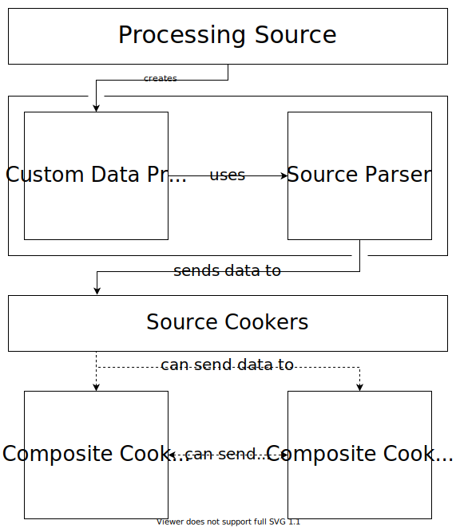

# Creating a Data Processing Pipeline

## Overview

Data Processing Pipelines (DPPs) allow you to compose components together that 
map data between inputs and outputs. A DPP is comprised of the following:
1) one __source parser__
2) one or more `DataCooker`s (cookers)

For a real world example of a pipeline, see the LTTng SDK plugin, found on GitHub [here](https://github.com/microsoft/Microsoft-Performance-Tools-Linux)

Cookers can be further broken down into: 
1) `SourceCooker`s
2) `CompositeCooker`s

`SourceCooker`s take data directly from a source parser and produce 
`DataOutput`s. `CompositeCooker`s take data from other cookers to produce 
`DataOutput`s. A `CompositeCooker` may depend on both __source__ *and* 
 __composite__ cookers.

The following illustrates these concepts:



All cookers expose zero or more __data outputs__. `DataOutput`s expose data that 
can be consumed by users of the DPP or other cookers in the DPP. 

## Source Parsers

__Source parsers__ parse data from a data source into data that can be 
manipulated by your application. For example, a source parser may parse an ETW 
ETL file into a stream of `Event` objects.  The following are required in order to implement a 
source parser:
1) A `CustomDataSource`
2) A class implementing `SourceParserBase`
3) A `CustomDataProcessor` implementing `CustomDataProcessorBaseWithSourceParser`

A `CustomDataSource` is required in order to expose your data, whether 
you are using DPPs or not. The `CustomDataSource` is used as the entry point for 
creating `CustomDataProcessor`s for processing your data. Please see 
[here](/Creating-a-simple-sdk-plugin) for more on `CustomDataSource`s. 

The source parser implements the actual logic of parsing the raw data 
into the initial object stream. This source parser is passed to the `CustomDataProcessor` 
so that the SDK can use it when it comes time for the `CustomDataProcessor` to 
process the data sources.

A source parser will inherit from `SourceParserBase`:
````cs
public abstract class SourceParserBase<T, TContext, TKey>
{
    ...
}
````

where `T` is the type of objects being parsed, `TContext` is an arbitrary type 
where you can store metadata about the parsing, and `TKey` is how the data type `T` is keyed.

Source parsers expose an `Id` property that is used to identify itself.
This property is used in __paths__ to the data exposed by the Source Parser.
The sections on Cookers will go into more detail about these Paths.

The following snippet outlines these three components working together to implement
what is required:

````cs

    [CustomDataSource(
        // Id here,
        // Name here,
        // Description here
    )]
    // Other attributes here
    public sealed class SampleCustomDataSource
        : CustomDataSourceBase
    {
        protected override ICustomDataProcessor CreateProcessorCore(
            IEnumerable<IDataSource> dataSources, 
            IProcessorEnvironment processorEnvironment, 
            ProcessorOptions options)
        {
            // The parser has a custom constructor to store
            // the data sources it will need to parse
            var parser = new SampleSourceParser(dataSources);

            return new SampleProcessor(
                parser,
                options,
                this.ApplicationEnvironment,
                processorEnvironment,
                this.AllTables,
                this.MetadataTables);
        }

        ...
    }

    public sealed class SampleProcessor
        : CustomDataProcessorBaseWithSourceParser<SampleDataObject, SampleContext, int>
    {
        public SampleProcessor(
            ISourceParser<SampleDataObject, SampleContext, int> sourceParser, 
            ProcessorOptions options,
            IApplicationEnvironment applicationEnvironment, 
            IProcessorEnvironment processorEnvironment, 
            IReadOnlyDictionary<TableDescriptor, Action<ITableBuilder, IDataExtensionRetrieval>> allTablesMapping,
            IEnumerable<TableDescriptor> metadataTables) 
            : base(sourceParser, options, applicationEnvironment, processorEnvironment, allTablesMapping, metadataTables)
        {
        }
    }

    public sealed class SampleSourceParser
        : SourceParserBase<SampleDataObject, SampleContext, int>
    {
        private DataSourceInfo dataSourceInfo;

        public SampleSourceParser(IEnumerable<IDataSource> dataSources)
        {
            ...
        }

        // The ID of this Parser.
        public override string Id => nameof(SampleSourceParser);

        // Information about the Data Sources being parsed.
        public override DataSourceInfo DataSourceInfo => this.dataSourceInfo;

        public override void ProcessSource(
            ISourceDataProcessor<SampleDataObject, SampleContext, int> dataProcessor,
            ILogger logger,
            IProgress<int> progress, CancellationToken cancellationToken)
        {
            // Enumerate your data sources, processing them into objects.
            // For each object you parse, be sure to call dataProcessor.ProcessDataElement.
            // for example:
            //      dataProcessor.ProcessDataElement(
            //          new SampleDataObject()
            //          new SampleContext(),
            //          cancellationToken);
            //
            // Also be sure to set this.dataSourceInfo in this method
        }

        ...
    }

````

## Cookers

__Cookers__ transform data from one type to another. A cooker will transform the 
output from one or more sources, optionally producing new `DataOutput`s for other Cookers 
or end user applications to consume.

__Source cookers__ take data directly from a __source parser__ to produce `DataOutput`s.

__Composite cookers__ take data from one or more cookers (Source or Composite) 
to create `DataOutputs`.

We use the term _cooked_ to denote Data that has been transformed via a cooker.

Cooked data is exposed via `DataOutput`s. These `DataOutput`s 
may be consumed directly by the user, or by other cookers. `DataOutput`s must 
implement the following interface:
````cs
IKeyedDataItem<T>
````

Data Outputs are identified by `DataOutputPath`s, 
which uniquely identify the `DataOutput`. A `DataOutputPath` has the following format:
````cs
    CookerPath/DataOutputPropertyName
````

where
- `CookerPath` is the path to the cooker exposing the data.
- `DataOutputPropertyName` is the name of the property exposing the `DataOutput`.

A `CookerPath` has the following format:
````cs
    SourceParserId/CookerId
````

where
- `SourceParserId` is the ID of the `SourceParser`.
- `CookerId` is the ID of the cooker.

`CompositeCooker`s will have an empty (`""`) `SourceParserID` as they are not
tied to any particular source parser, and thus their paths have the following
form:
````cs
    /CookerId
````

The following snippet shows simple cookers:

````cs

    // A SourceCooker
    public sealed class SampleSourceCooker
        : BaseSourceDataCooker<SampleDataObject, SampleContext, int>
    {
        public static readonly DataCookerPath DataCookerPath = new DataCookerPath(
            nameof(SampleSourceParser),
            nameof(SampleSourceCooker));

        public SampleDataCooker()
            : this(DataCookerPath)
        {
        }

        public SampleSourceCooker() 
            : base(DataCookerPath)
        {
            this.Objects = new List<SampleDataObject>();
        }

        public override string Description => string.Empty;

        public override ReadOnlyHashSet<int> DataKeys => new ReadOnlyHashSet<int>(new HashSet<int>(new[] { 1, }));

        // Defines a DataOutput.
        // The path of this output is
        //      SampleSourceParser/SampleSourceCooker/Objects
        [DataOutput]
        public List<SampleDataObject> Objects { get; }

        public override DataProcessingResult CookDataElement(
            SampleDataObject data, 
            SampleContext context, 
            CancellationToken cancellationToken)
        {
            //
            // Process each data element. This method will be called once
            // for each SampleDataObject emitted by the SourceParser.
            //

            ...

            //
            // Return the status of processing the given data item.
            //
            return DataProcessingResult.Processed;
        }
    }

    // A CompositeCooker
    public sealed class SampleCompositeCooker
        : CookedDataReflector,
          ICompositeDataCookerDescriptor
    {
        public static readonly DataCookerPath DataCookerPath = new DataCookerPath(nameof(SampleCompositeCooker));

        public SampleCompositeCooker()
            : base(DataCookerPath)
        {
            this.Output = new List<Composite1Output>();
        }

        public string Description => "Composite Cooker";

        public DataCookerPath Path => DataCookerPath;

        // Defines a DataOutput.
        // The path of this output is
        //      /SampleCompositeCooker/Objects
        [DataOutput]
        public List<SampleCompositeOutput> Output { get; }

        // Declare all of the cookers that are used by this CompositeCooker.
        public IReadOnlyCollection<DataCookerPath> RequiredDataCookers => new[]
        {
            // SampleSourceParser/SampleSourceCooker
            SampleSourceCooker.DataCookerPath,
        };

        public void OnDataAvailable(IDataExtensionRetrieval requiredData)
        {
            //
            // Query data as appropriate and populate the Output property.
            //
            ...

            //
            // There is no need to return a status, as Composite Cookers
            // run after all Source Cookers have run.
            //
        }
    }
````

To get data from a `DataCooker`, the cooker must be __queried__ using an `IDataExtensionRetrieval`, 
such as the one passed into `OnDataAvailable` in the above `CompositeCooker`. Since the 
`CompositeCooker` depends on `SampleSourceCooker`, we can query its `Objects` property as follows:

```cs
public void OnDataAvailable(IDataExtensionRetrieval requiredData)
{
    var data = 
        requiredData.QueryOutput<List<SampleDataObject>>(new DataOutputPath(SampleSourceCooker.DataCookerPath, "Objects"));

    //
    // Process this data and populate the Output property.
    //

    ...
}
```

## Extensibility

In addition to using your own cookers to create a DPP, the SDK allows you to use cookers  
authored by other people. In order to use a cooker from another plugin, all you 
need to do is declare the path to the cooker as a dependency, the same as you 
would for your own.

## Using the Pipeline

You may use the `Engine` to programmatically access your DPP. For example,
````cs
var engine = new Engine();

engine.EnableCooker(
    "SampleSourceParser/SampleSourceCooker"
);

engine.AddDataSource(
    // Data Source
);

var results = engine.Process();

// Note that we can call QueryOutput using the string path instead of creating a new 
// DataOutputPath object
var sample = results.QueryOutput<List<SampleDataObject>>("SampleSourceParser/SampleSourceCooker/Objects");
````

The LTTng Plugin Repository has many examples of using the Engine in this capacity.
[LTTngUnitTest](https://github.com/microsoft/Microsoft-Performance-Tools-Linux/blob/develop/LTTngDataExtUnitTest/LTTngUnitTest.cs) makes 
use of the engine to add files, enable Cookers, and query their Cooked Data.

# Next Steps
Now that we've seen how to create a data processing pipeline inside your SDK plugins, 
we can see how to connect DPPs up to the tables your plugin defines. 
Continue reading at [Using the SDK/Creating an Extended Table](./Creating-an-extended-table.md)