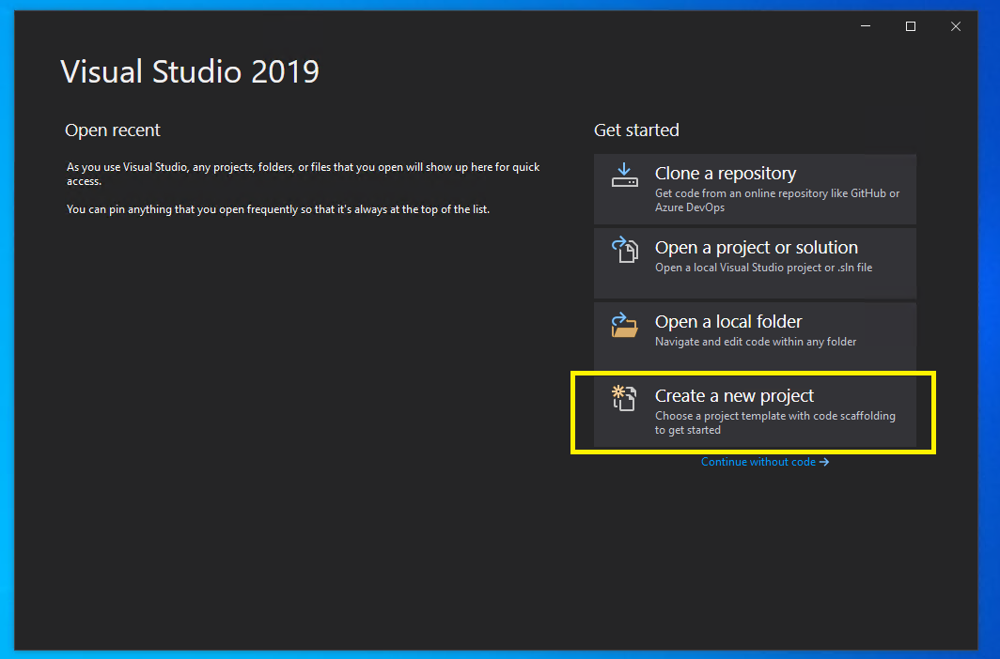
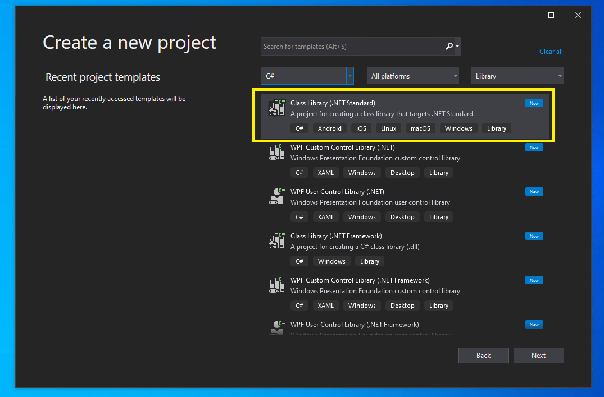

# Creating an SDK Plugin

This document outlines how to use the Performance Toolkit SDK (SDK) to create
an SDK plugin. Plugins can be used to expose data from `DataSource`s for
automation, trace extractors, or viewers (e.g. Windows Performance Analyzer).

Before creating a plugin, it is recommended to read [the overview of the SDK's architecture](../Architecture/Overview.md).

Creating a plugin can be outlined into 4 distinct steps:
1. [Creating the Project](#creating-the-project)
  * [Requirements](#requirements)
  * [Creating Your Project](#creating-your-project)
  * [Configuring Your Project](#configuring-your-project)
    * [Add the Microsoft.Performance.SDK NuGet Package](#add-the-microsoftperformancesdk-nuget-package)
    * [Picking your SDK version](#picking-your-sdk-version)
    * [Install WPA for Debugging](#install-wpa-for-debugging)
    * [Setup for Debugging Using WPA](#setup-for-debugging-using-wpa)
2. [Creating a ProcessingSource](#creating-a-processingsource)
  * [Create a ProcessingSource class](#create-a-processingsource-class)
  * [Decorate your ProcessingSource with the ProcessingSourceAttribute](#decorate-your-processingsource-with-the-processingsourceattribute)
  * [Decorate your ProcessingSource with a DataSourceAttribute](#decorate-your-processingsource-with-a-datasourceattribute)
  * [Implement the required ProcessingSource methods](#implement-the-required-processingsource-methods)
  * [(Optional) Adding About Information](#(optional)adding-about-information)
3. [Choosing a Plugin Framework](#choosing-a-plugin-framework)
4. [Creating a CustomDataProcessor and Tables](#creating-a-customdataprocessor-and-tables)

---

## Creating the Project

Plugins are created as C# class libraries that get dynamically loaded by the SDK runtime. To begin your plugin creation, we will first walk through creating a C# project.

> :information_source: The SDK team is actively working on creating a dotnet template to simplify creating your project and writing the neccessary plugin boilerplate code. 

For simplicity, this section will assume you are using Visual Studio. The instructions may be adapted for other editors / IDEs.

### Requirements

1. [Visual Studio](https://visualstudio.microsoft.com/downloads/)
2. [.NET SDK that supports .NET Standard 2.0](https://dotnet.microsoft.com/download/visual-studio-sdks)
   * [See .NET Standard 2.0 support options](https://docs.microsoft.com/en-us/dotnet/standard/net-standard)

Please refer to the links above to download and install the necessary requirements.

### Creating Your Project

1) Launch Visual Studio
2) Click "Create new project"  
 
3) Select .NET Standard on the left, and choose "Class Library (.NET Standard)." Make sure that you are using .NET Standard 2.0, or a .NET version that supports .NET Standard 2.0 (such as .NET Core 3.1, .NET 6, etc.).
 
4) Name your project
5) Click "Create"

### Configuring Your Project

You should now have a solution with one project file.

#### Add the Microsoft.Performance.SDK NuGet Package

[This documentation](https://docs.microsoft.com/en-us/nuget/quickstart/install-and-use-a-package-in-visual-studio) describes how to add a NuGet package to a Visual Studio project. Following these instructions, add the `Microsoft.Performance.SDK` package from [nuget.org](nuget.org) to your project.

#### Picking your SDK version
The version of the SDK you add to your project will determine which versions of SDK drivers your plugin will work with. For example, a plugin that depends on SDK version 0.109.2 will not work a version of an SDK driver that uses SDK version 1.0.0.

To decide which version of the SDK to use, refer to the [known SDK driver compatibility lists](../Known-SDK-Driver-Compatibility/Overview.md).

#### Install WPA for Debugging

One way to debug an SDK plugin project is to use WPA. Before we setup our project for this, WPA will need to be installed. 
Please see [Using the SDK/Installing WPA](./Installing-WPA.md) for more information how to install WPA.

#### Setup for Debugging Using WPA

1) Right click your project and select "Properties"
2) Select the "Debug" tab on the left
   * In newer versions of Visual Studio, you may need to click "Open debug launch profiles UI"
3) For "Launch", select "Executable"
4) For the "Executable", place the path to the `wpa.exe` that you previously installed as part of the WPT
   * Typically this might be: `C:\Program Files (x86)\Windows Kits\10\Windows Performance Toolkit\wpa.exe`
5) For "Command line Arguments", add `-nodefault -addsearchdir <bin folder for your plugin>` (e.g. `-nodefault -addsearchdir C:\MyAddIn\bin\Debug\netstandard2.1`)

The above changes will cause Visual Studio to launch your installed WPA with the command line arguments listed above passed in whenever you start debugging your plugin (via `Debug` => `Start Debugging`). The commandline arguments listed above tell WPA to load plugins only from the directory provided.

> :information_source: If you're developing a plugin that uses `DataCookers` from other plugins, you may wish to **not** include the `-nodefault` flag.

If you encounter issues loading your plugin in WPA, please refer to [Troubleshooting documentation](../Troubleshooting.md#wpa-related-issues).

---

## Creating a ProcessingSource

Every plugin, regardless of the plugin framework chosen below, requires at least one `ProcessingSource`. Each `ProcessingSource` is an entry point for your plugin; they are what the SDK looks for when your plugin loads.

### Create a ProcessingSource class

In the project created above, replace the default `Program` class with one that extends the `ProcessingSource` class provided by the SDK.

```cs
public class MyProcessingSource : ProcessingSource
{
   public MyProcessingSource() : base()
   {
   }
}
```

> :warning: Note that while a single assembly *can* define more than one `ProcessingSource`, __it is highly recommended that an assembly only contains 
> a single `ProcessingSource`.__ Tables, data cookers, and custom data processors are almost always associated with a single `ProcessingSource`. 
> It is best therefore to package __only one__ `ProcessingSource` and all of its associated classes in a single binary. 

### Decorate your ProcessingSource with the ProcessingSourceAttribute

The SDK finds your `ProcessingSource` by looking for classes with a `ProcessingSourceAttribute`. This attribute gives the SDK information about your `ProcessingSource`, such as its name, description, and globally-unique id (`GUID`).

```cs
[ProcessingSource(
   "{F73EACD4-1AE9-4844-80B9-EB77396781D1}",  // The GUID must be unique for your ProcessingSource. You can use 
                                              // Visual Studio's Tools -> Create Guid… tool to create a new GUID
   "Simple Data Source",                      // The ProcessingSource MUST have a name
   "A data source to count words!")]          // The ProcessingSource MUST have a description
public class MyProcessingSource : ProcessingSource
{
   public MyProcessingSource() : base()
   {
   }
}
```

Though your `ProcessingSource` is discoverable to the SDK, it still needs to advertise the `DataSource(s)` it supports in order to be useful.

### Decorate your ProcessingSource with a DataSourceAttribute

In order to advertise the `DataSource(s)` your `ProcessingSource` supports, we must decorate it with a `DataSourceAttribute`. `DataSourceAttribute` is an abstract class provided by the SDK, so we must decide on a concrete implementation to use. 

> __The concrete implementation of the `DataSourceAttribute` you decide to use determines what kind of inputs your `ProcessingSource` will receive from users.__

We can either make our own `DataSourceAttribute`, or use one of the implementations the SDK provides. The SDK provides implementations for common `DataSources`, such as the `FileDataSourceAttribute` - an attribute that tells the SDK your `ProcessingSource` should receive files opened by a user.

For this example, let's use the `FileDataSourceAttribute`:

```cs
[ProcessingSource(
   "{F73EACD4-1AE9-4844-80B9-EB77396781D1}",
   "Simple Data Source",
   "A data source to count words!")]
[FileDataSource(
   ".txt",                                    // A file extension is REQUIRED
   "Text files")]                             // A description is OPTIONAL. The description is what appears in the 
                                              // file open menu to help users understand what the file type actually is
public class MyProcessingSource : ProcessingSource
{
   public MyProcessingSource() : base()
   {
   }
}
```

By specifying `".txt"`, the SDK will route any `.txt` files opened by a user to our `ProcessingSource`.

### Implement the required ProcessingSource methods

There are two methods a `ProcessingSource` is required to implement: `IsDataSourceSupportedCore` and `CreateProcessorCore`.

`IsDataSourceSupportedCore` is called for each `DataSource` opened by a user that matches the `DataSourceAttribute` on your `ProcessingSource`. This is needed because your `ProcessingSource` may not be able to handle every `DataSource` opened. For example, our `ProcessingSource` advertises support for `.txt` files, but it may only be able to process files with specific contents.

For this example, let's do a basic check. We will check that the filename starts with `mydata`. This means our `ProcessingSource` could be asked to process a file named `mydata_2202.txt`, but not a file named `random_text_file.txt`. 

```cs
[ProcessingSource(...)]
[FileDataSource(...)]
public class MyProcessingSource : ProcessingSource
{
   public MyProcessingSource() : base()
   {
   }

   protected override bool IsDataSourceSupportedCore(IDataSource dataSource)
   {
      if (!(dataSource is FileDataSource fileDataSource))
      {
         return false;
      }

      return Path.GetFileName(fileDataSource.FullPath).StartsWith("mydata");
   }
}
```

Lastly, we need to implement `CreateProcessorCore`. A processor is a class whose job is processing the `DataSource(s)` opened by a user that pass the the `IsDataSourceSupportedCore` implemented above. Let's create a stub for this method:

```cs
[ProcessingSource(...)]
[FileDataSource(...)]
public class MyProcessingSource : ProcessingSource
{
   public MyProcessingSource() : base()
   {
   }

   protected override bool IsDataSourceSupportedCore(IDataSource dataSource)
   {
      ...
   }

   protected override ICustomDataProcessor CreateProcessorCore(
      IEnumerable<IDataSource> dataSources,
      IProcessorEnvironment processorEnvironment,
      ProcessorOptions options)
   {
      //
      // Create a new instance of a class implementing ICustomDataProcessor here to process the specified data 
      // sources.
      // Note that you can have more advanced logic here to create different processors if you would like based 
      // on the file, or any other criteria.
      // You are not restricted to always returning the same type from this method.
      //

      return new MyDataProcessor(...); // TODO: pass correct arguments
   }
}
```

Currently, `MyDataProcessor` does not exist and we do not know which arguments to pass in. This is because the implementation of `MyDataProcessor` depends on the plugin framework you choose in the [Choosing a Plugin Framework](#choosing-a-plugin-framework) step. We will revisit this method once we have created `MyDataProcessor`.

At this point, our `ProcessingSource` is almost complete. Before we continue, however, we must [choose a plugin framework](#choosing-a-plugin-framework).

### (Optional) Adding About Information

When a plugin is used by a large and/or public audience, it is useful to 
give users an easy way to contact its owners/maintainers. SDK Drivers such as 
WPA look for __about information__ on a `ProcessingSource` for it to  
present to users.

To add about information to your `ProcessingSource`, simply override or 
implement `GetAboutInfo`:

```cs
[ProcessingSource(...)]
public class MyProcessingSource
    : ProcessingSource
{
    // ...

    public override ProcessingSourceInfo GetAboutInfo()
    {
        return new ProcessingSourceInfo
        {
            Owners = new[]
            {
                new ContactInfo
                {
                    Name = "Author Name",
                    Address = "Author Email",
                    EmailAddresses = new[]
                    {
                        "owners@mycompany.com",
                    },
                },
            },
            LicenseInfo = null,
            ProjectInfo = null,
            CopyrightNotice = $"Copyright (C) {DateTime.Now.Year}",
            AdditionalInformation = null,
        };
    }
}
```

or

```cs
[ProcessingSource(...)]
public class MyOtherProcessingSource
    : IProcessingSource
{
    // ...

    public ProcessingSourceInfo GetAboutInfo()
    {
        return new ProcessingSourceInfo
        {
            Owners = new[]
            {
                new ContactInfo
                {
                    Name = "Author Name",
                    Address = "Author Email",
                    EmailAddresses = new[]
                    {
                        "owners@mycompany.com",
                    },
                },
            },
            LicenseInfo = null,
            ProjectInfo = null,
            CopyrightNotice = $"Copyright (C) {DateTime.Now.Year}",
            AdditionalInformation = null,
        };
    }
}
```

Where your about information is displayed depends on the SDK driver in which your plugin 
is loaded. In Windows Performance Analyzer, your about information will appear as 
a tab in the `Help -> About Windows Performance Analyzer` dialog.

## Choosing a Plugin Framework

The SDK supports two distinct plugin frameworks:
1. The "simple" plugin framework where
   1. All classes and data are self-contained in the created plugin
   2. The plugin author is responsible for creating a `DataSource` processing system
2. The "data-processing pipeline" framework where
   1. Data can be shared between plugins through the creation of a Data-Processing Pipeline
   2. The SDK facilities efficient processing of `DataSources` through a Data-Processing Pipeline

> :warning: While the SDK fully supports "simple" plugin framework plugins, many of its features are designed with the "data-processing pipeline" framework in mind. If you choose to use the "simple" plugin framework, __you will not be able to use several SDK features (such as the ones listed below) in your plugin__. Going forward, the primary focus of new SDK features will be centered around data-processing pipelines.

It is __highly recommended__ that you use a data-processing pipeline framework when constructing your plugin. There are multiple benefits to this framework:
1. `DataSources` are processed in an efficient manner
2. Your plugin's architecture is scalable by default
3. Your plugin's architecture has strict separation of concerns
4. Your plugin can __utilize data from other plugins__
5. Your plugin can __share data with other plugins__

The simple plugin framework is primarily useful for _very rapid prototyping_ of your plugin. Once you are comfortable with the SDK and its concepts, we highly encourage switching your plugin to the data-processing pipeline framework.

## Creating a CustomDataProcessor and Tables

The last high-level components that must be created are a `CustomDataProcessor` and `Tables`. The implementation of these components depend on the plugin framework you chose above.

For a plugin following the simple plugin framework, refer to [Using the SDK/Creating a Simple SDK Plugin](./Creating-a-simple-sdk-plugin.md).

For a plugin following the data-processing pipeline framework, refer to [Using the SDK/Creating a Data-Processing Pipeline](./Creating-a-pipeline.md) and [Using the SDK/Creating a Table](./Creating-a-table.md)
