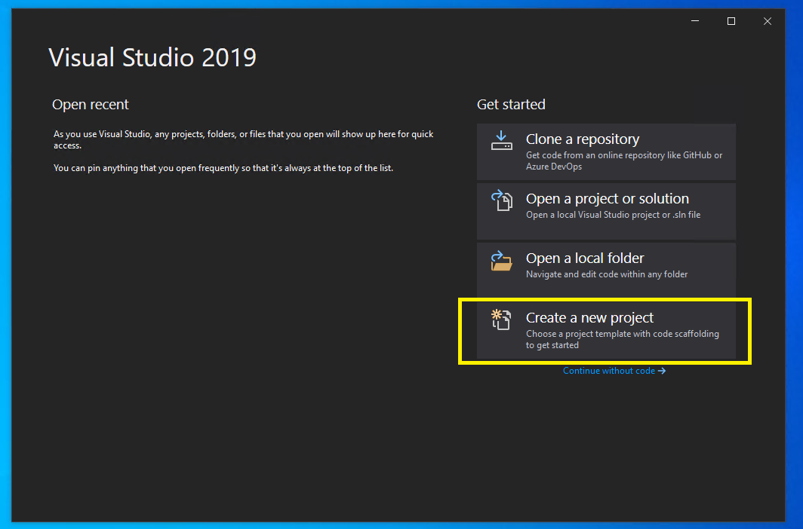

# Creating an SDK Plugin C# Project

This document outlines how to use the Performance Toolkit SDK (SDK) to create
an SDK plugin. A plugin can be used for processing trace files to be used by
automation, trace extractors, or viewers such as Windows Performance Analyzer
(WPA). This document will cover:
1) [Requirements](#reqs)
2) [Creating your project](#createproj)
3) [Configuring your project to launch WPA with your plugin under a debugger](#configure)

For simplicity, this section will assume you are using Visual Studio 2019. The instructions may be adapted for other editors / IDEs.

# Requirements

1. [Visual Studio 2019](https://visualstudio.microsoft.com/downloads/)
2. [.NET SDK that supports .NET Standard 2.0](https://dotnet.microsoft.com/download/visual-studio-sdks)
   * [See .NET Standard 2.0 support options](https://docs.microsoft.com/en-us/dotnet/standard/net-standard)

## Visual Studio 2019

You can install Visual Studio 2019 from here: https://visualstudio.microsoft.com/downloads/.
Any edition is capable of creating an SDK Plugin.

1. Download the installer
2. Execute the installer
3. Make sure that the following features are selected:
   * .NET Desktop Development (Make sure to select an appropriate .NET SDK for development option.)
4. Click Install
5. You may have to restart your computer when installation finishes.

## .NET Standard 2.0

If you installed Visual Studio 2019 based on the above instructions, then you are good to go. Otherwise,

1. Execute your VS2019 installer, and choose to "Modify" the installation.
2. Make sure that the following features are selected:
   * .NET Desktop Development (Should include an appropriate .NET SDK for .NET Standard 2.0)
3. Click "Modify" to modify your installation.
4. You may need to restart your computer when modification finishes.

## NuGet Feeds

TODO: add VS instructions here

# Creating the Project

1) Launch Visual Studio 2019
2) Click "Create new project"  
 
3) Select .NET Standard on the left, and choose "Class Library (.NET Standard)." Make sure that you are using .NET Standard 2.1  
 
4) Give your project whatever name you want.
5) Click "Create"

# Configuring Your Project

You should now have a solution with one project file.

## Add Microsoft.Performance.SDK nuget

[This documentation](https://docs.microsoft.com/en-us/nuget/quickstart/install-and-use-a-package-in-visual-studio) describes how to add a nuget package to a Visual Studio project. Following these instructions, add package Microsoft.Performance.SDK from nuget.org to your project.

## Install WPA for debugging purposes

One way to debug an SDK Plugin project is to use WPA. Before we setup our project for this, WPA will need to be installed. Please see [Installing-WPA](./Installing-WPA.md).

## Setup for debugging using WPA

- Right click your project and select Properties.
- Select the 'Debug' tab on the left.
- For 'Launch', select 'Executable'
- For the 'Executable', place the path to the wpa.exe that you previously installed as part of the WPT.
  * Typically this might be: "C:\Program Files (x86)\Windows Kits\10\Windows Performance Toolkit\wpa.exe"
- For 'Command line Arguments', add '-addsearchdir [bin folder for your plug-in]' (e.g. -addsearchdir C:\MyAddIn\bin\Debug\netstandard2.1)

# Next steps

The project is now created and configured and it is time to start writing the SDK Plugin. See one of the following documents for further help:

* [Creating a Simple Custom Data Source](./Creating-a-simple-custom-data-source.md) to see how to create a basic plugin that can take in a specific data source and output structured tables
* [Creating a Data Processing Pipeline](./Creating-a-pipeline.md) to see how to create a data processing pipeline that 
exposes data that can be consumed by your tables and other plugins
* [Creating an Extended Table](./Creating-an-extended-table.md) to see how to use data cookers to obtain the data to display inside of a table