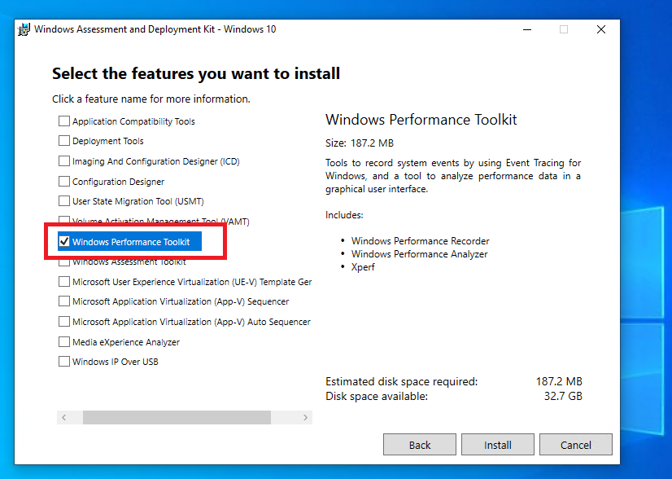

# Windows Performance Analyzer

Windows Performance Analyzer (WPA) is a Windows application used to open data sources - typically performance trace files - 
for visual analysis. It supports loading SDK plugins to augment the types of data sources it can process. 
When developing an SDK plugin, WPA is a useful debugging tool.

# Installation

WPA is bundled as part of the [Windows Performance Toolkit](https://docs.microsoft.com/en-us/windows-hardware/test/wpt/) which may be installed as part of the [Windows Assessment and Deployment Kit](https://docs.microsoft.com/en-us/windows-hardware/get-started/adk-install).

- Download and run the setup program for the Windows Assessment and Deployment Kit.
- Chose an installation path and follow installation instructions until you reach the "Select the features you want to install" screen.
  * Take note of the installation path as it will be used when debugging SDK plugin projects.
- Make sure to select "Windows Performance Toolkit" from this screen.  
- Click "Install and Close" when installation is complete.